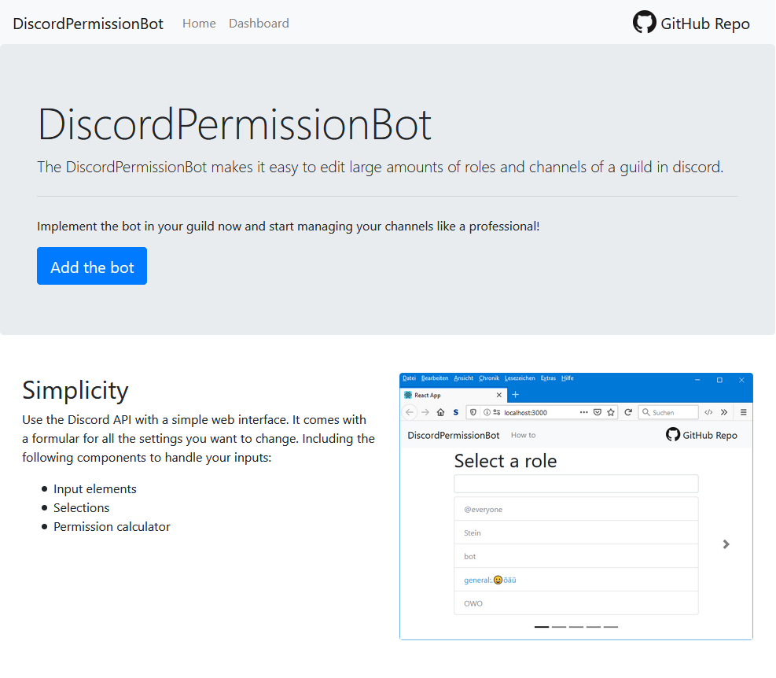
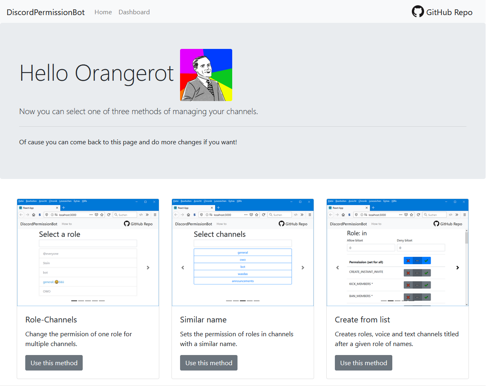
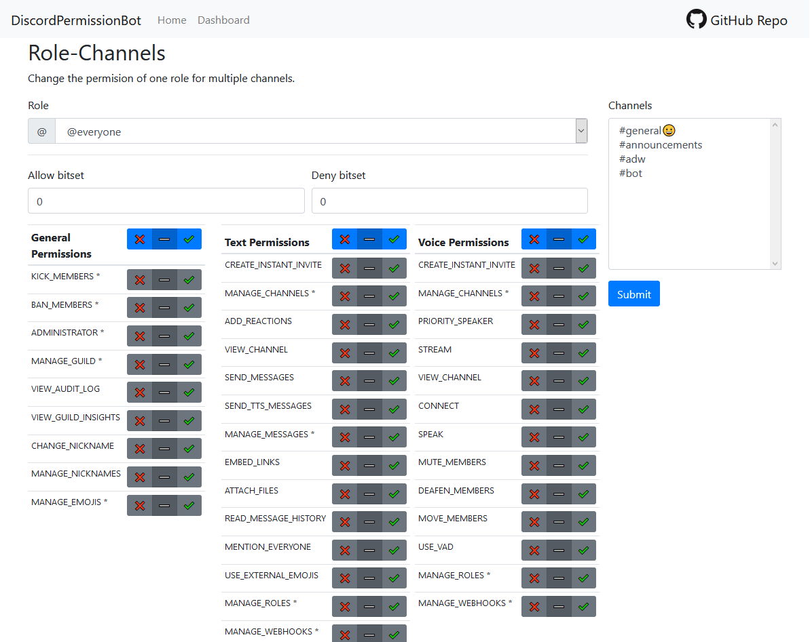
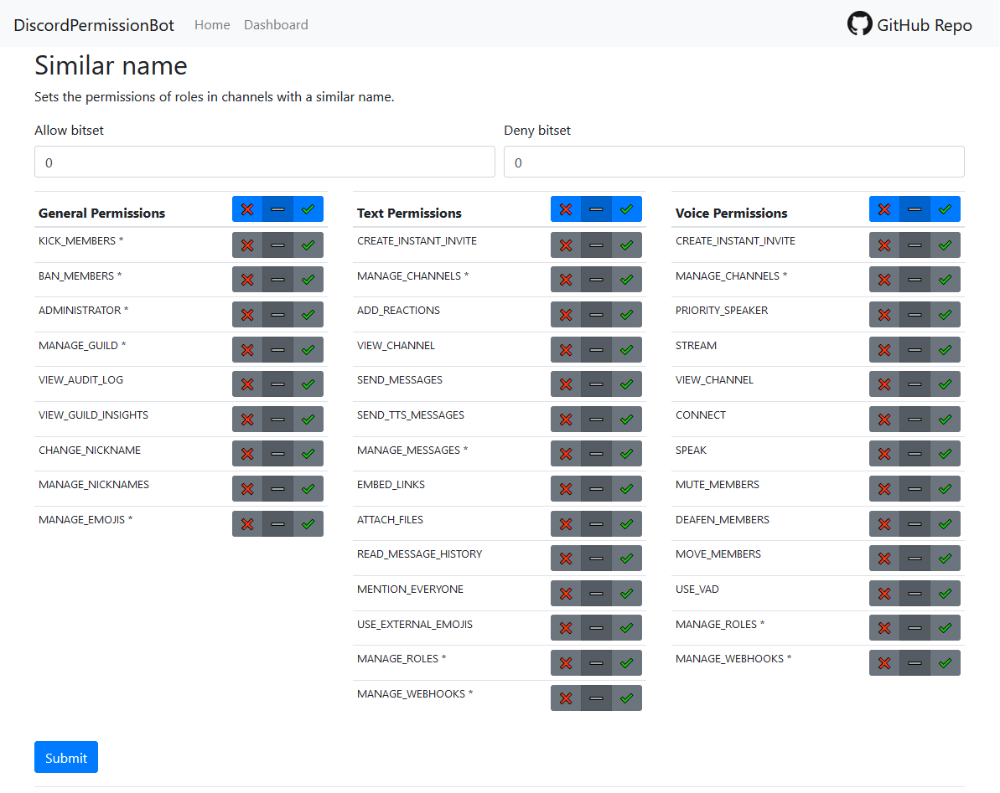

# DiscordPermissionBot

The permission bot makes it easier to organize roles, channels and categories.



## About

The DiscordPermissionBot makes it easy to edit large amounts of **roles and channels** of a guild in discord. It comes with a **web interface**, if you just want the thing done. Or if you want to go hackerman style, you can use the **CLI-tools** and use the console.

The whole project when build is made to live on a normal webserver. So if you want to help you not so tech-savvy friends out, who just started a new guild for the whole grade level of your school but don't want to edit every channel and role so that each class and course has its own, here you go *(yes that is the reason behind this project)*.

---

## Table of contents

* [About](#about)
* [Installation](#installation)
  * [Requirements](#requirements)
  * [Web version](#install-web-version)
    * [PHP](#php)
  * [CLI version](#install-cli-version)
* [How to use](#how-to-use)
  * [Web version](#use-web-version)
  * [CLI version](#use-cli-version)
* [Development](#development)

---

## Installation

### Requirements

* [Webserver (Apache, XAMPP, WAMP, ...)](https://www.apachefriends.org/de/index.html)
* [Composer](https://getcomposer.org/)
* PHP-CLI for CLI-version (included in XAMPP)

### Install web version

#### PHP

You need to install a webserver with PHP first (Apache, XAMPP, WAMP, ...). After the installation, you need to put this repo in the `htdocs/` or `www/` folder in the directory of your webserver. You also have to install the package manager for PHP called composer. After composer is installed you need to type the following command in the console in the main directory of this repo. This will install the PHP library for the Discord API called RestCord.

```sh
composer install
```

After the installation of the package, you need to copy the `.htaccess.example` and rename it to `.htaccess` and change the `*your_discord_bot_token_here*` to your bot token from the Discord API website. You also need to change the `*client_id_here*` and `*client_secret_here*` to the ones of your discord application.

For production you can simply but the repo on a hosted webserver of your choice.

### Install CLI version

Basically do the same thing as in the PHP installation guide for the web version. But you don't have to change the `.htaccess`. And you don't need a webserver but the PHP CLI version installed on you computer. But if you have XAMPP installed you should be fine already.

So install PHP CLI and composer. Install PHP packages with `composer install`.

---

## How to use

### Use web version

First you need to add the bot and log in by clicking on the `Add the bot` button on the home page. You will get redirected to the discord website on which you need to select the guild on which the bot should join and you need to autorise the bot to have some permissions.

After that the bot joined the guild and you are logged in to the dashboard. Here you can select a method to modify the permissions. For now you can choose between **role-channels**, **similar name** or **create from list**.



On each method you can enter some inputs. The opperation will start after you clicked on the submit button. Look into a channels permission settings in your discord client to see the results. If the operation was not successfull you might have forgotten to enter required inputs or you might have selected to much channels. Try to split the operation into smaller ones.

If you wonder why a permission toggle effects an other permission, that is because some permissions codes are available for text and for voice permissions.



### Use CLI version

First you need to invite the bot to the guild where you want to change the permissions. For that go to the Discord API website and go to you application. You can create an auhtorisation link under the OAuth2 tab. Choose Scope `bot` and bot permission `manage channels` or if you really trust this application you can give it Administrator rights. Copy the link and open it in your browser. You should get an option window where you can select the server where the bot should join. Select your server and click next. Agree with the permissions and your bot should join your server.

Open a console in the .cli-tools directory. From there you have two PHP scrips to choose from. The role-channel.php script changes the permission of one role in one channel. It takes in 5 arguments.

You need to give the token with the `-t` flag, the role id with the `-c` flag, the channel id with the `-c` flag and the permission bitSets with the allow and deny flag named `-a` and `-d`.

Here is an example:

```sh
php role-channel.php -r696671361304887316 -c306153733497028610 -a2048 -d0 -tYOUR_TOKEN
```

The other scipt with the name `similarName.php` might be a bit more usefull. It looks if roles and channels have a similar name and then applies a permission for the role in the channel with the same name.

This script takes in 4 arguments. You need to give the token flag `-t` as well and the `-a` and `-d` flags are also the same. But now you need to give in the gruild id `-g`.

Here is an example:

```sh
php similarName.php -g306153733497028610 -a2048 -d0 -tYOUR_TOKEN
```

You can calculate the permission bitSets with online calculators or you can use the calculator that is build in the user interface. 



---

## Development

If you edit the PHP scripts it might be good if the web interface server is running as well so you can test your work with requests from it. To see the responses of the script you have to call it via a browser. To update the responses you need to reload the page.

For the CLI tools you need to start it with the console to see the output. You might want to `var_dump` things to see the values.

Have fun programming!
