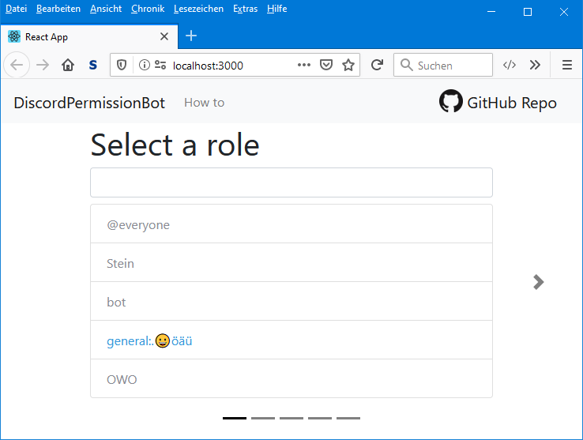
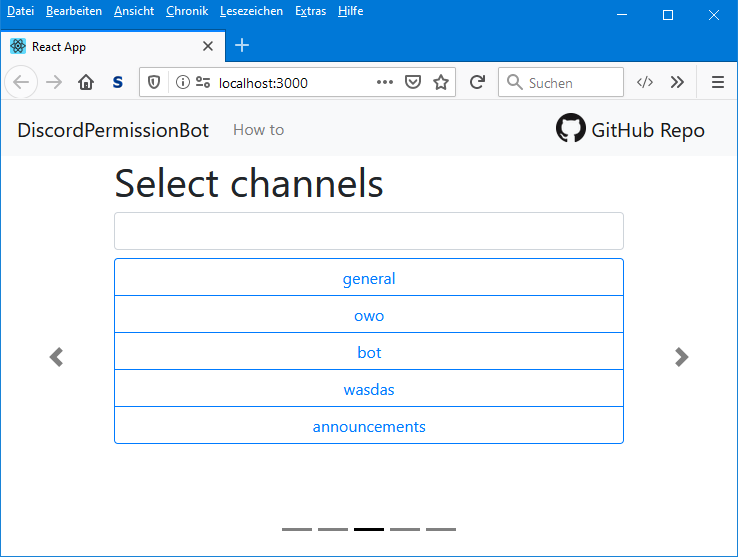
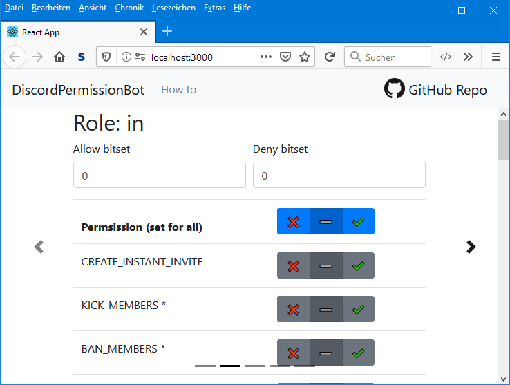

# DiscordPermissionBot

The permission bot makes it easier to organize roles, channels and categories.



## About

The DiscordPermissionBot makes it easy to edit large amounts of **roles and channels** of a guild in discord. It comes with a **web interface**, if you just want the thing done. Or if you want to go hackerman style, you can use the **CLI-tools** and use the console.

The whole project when build is made to live on a normal webserver. So if you want to help you not so tech-savvy friends out, who just started a new guild for the whole grade level of your school but don't want to edit every channel and role so that each class and course has its own, here you go *(yes that is the reason behind this project)*.

---

## Table of contents

* [About](#about)
* [Installation](#installation)
  * [Requirements](#requirements)
  * [Web version](#install-web-version)
    * [PHP](#php)
    * [JavaScript](#javascript)
  * [CLI version](#install-cli-version)
* [How to use](#how-to-use)
  * [Web version](#use-web-version)
  * [CLI version](#use-cli-version)
* [Development](#development)

---

## Installation

### Requirements

* [Webserver (Apache, XAMPP, WAMP, ...)](https://www.apachefriends.org/de/index.html)
* [Composer](https://getcomposer.org/)
* [Node.js + npm](https://nodejs.org/en/)

### Instal web version

#### PHP

You need to install a webserver with PHP first (Apache, XAMPP, WAMP, ...). After the installation, you need to put this repo in the `htdocs/` or `www/` folder in the directory of your webserver. You also have to install the package manager for PHP called composer. After composer is installed you need to type the following command in the console in the main directory of this repo. This will install the PHP library for the Discord API called RestCord.

```sh
composer install
```

After the installation of the package, you need to copy the `.htaccess.example` and rename it to `.htaccess` and change the `*your_discord_bot_token_here*` to your bot token from the Discord API website.

For production you can simply but the repo on a hosted webserver of your choice.

#### JavaScript

For the web interface you need to install Node.js and npm first. After the installation is complete go into the `discord-permission-bot-ui/` folder, open a console and type the following command. This command will install all the dependencies for the user interface like React and ract-bootstrap.

```sh
npm install
```

After the dependencies are installed you need to copy the `config.example.json` and rename it to `config.json`. Open the file and change the `bot_url` to the url of your webserver and the `server_id` to the id of the guild where you want the permissions to be changed. For that you would want to anable the developer mode in you discord client.

To test if all changes work start the webserver and start the web interface with the following command.

```sh
npm start
```

A browser window should open automatically and show the web interface. If you see roles and channels of your server all went fine.

For production you need to build the web interface and put the result in the main directory of this repo. To build the web interface you need to type the following command in the console in the ui directory. After that a `build` folder will be created. But the result in the main directory.

```sh
npm build
```

### Install CLI version

Basically do the same thing as in the PHP installation guide for the web version. But you don't have to change the `.htaccess`. And you don't need a webserver but the PHP CLI version installed on you computer. But if you have XAMPP installed you should be fine already.

So install PHP CLI and composer. Install PHP packages with `composer install`.

---

## How to use

First you need to invite the bot to the guild where you want to change the permissions. For that go to the Discord API website and go to you application. You can create an auhtorisation link under the OAuth2 tab. Choose Scope `bot` and bot permission `manage channels` or if you really trust this application you can give it Administrator rights. Copy the link and open it in your browser. You should get an option window where you can select the server where the bot should join. Select your server and click next. Agree with the permissions and your bot should join your server.

### Use web version

For now you need to put the guild id of the guild where you want the permissions to be changed in the config.js file. After that start the webserver and the user interface server and you should see the roles and channels of the guild you just write in the config file.

The only functionality for now is to change the permission for one role for selected channels. To do that select the role that permissions should be changed and click on the right arow to go to the next step. Now you can select the permissions for the role with the buttons or you can type the bitSet in the input field. After your are happy with the permissions click on the right arrow again. Now you can select multiple channels by clicking on them. These channels will have the permission with the role you just chose.



On the next page you see your selected values and can applie them with the submit button. You can the progress in the progress bar at the bottom. After it is at 100% percent all permissions are applied on the guild and you can take a look at it with your discord client. If you like you can go to the first page again and edit some more roles and channels now.

### Use CLI version

Open a console in the .cli-tools directory. From there you have two PHP scrips to choose from. The role-channel.php script changes the permission of one role in one channel. It takes in 5 arguments.

You need to give the token with the `-t` flag, the role id with the `-c` flag, the channel id with the `-c` flag and the permission bitSets with the allow and deny flag named `-a` and `-d`.

Here is an example:

```sh
php role-channel.php -r696671361304887316 -c306153733497028610 -a2048 -d0 -tYOUR_TOKEN
```

The other scipt with the name `similarName.php` might be a bit more usefull. It looks if roles and channels have a similar name and then applies a permission for the role in the channel with the same name.

This script takes in 4 arguments. You need to give the token flag `-t` as well and the `-a` and `-d` flags are also the same. But now you need to give in the gruild id `-g`.

Here is an example:

```sh
php similarName.php -g306153733497028610 -a2048 -d0 -tYOUR_TOKEN
```

You can calculate the permission bitSets with online calculators or you can use the calculator that is build in the user interface. For that you don't even need a webserver with PHP, just start the app with `npm start`.



---

## Development

Just install everything as it is said in the installation guide above. You can start the web interface server with `npm start` to get live feedback in your browser. If you edit the PHP scripts it might be good if the web interface server is running as well so you can test your work with requests from it. To see the responses of the script you have to call it via a browser. To update the responses you need to reload the page.

For the CLI tools you need to start it with the console to see the output. You might want to `var_dump` things to see the values.

Have fun programming!
